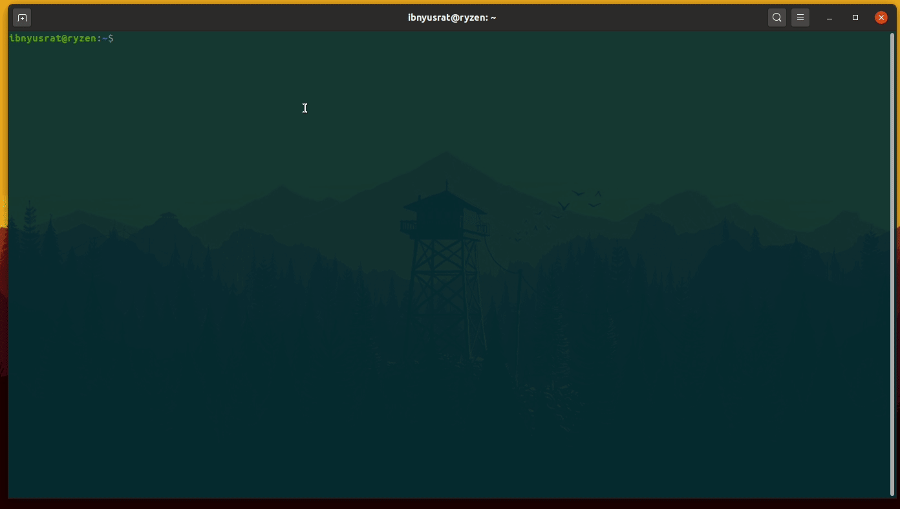

# Make VIM Look & Work like VS Code for Web Development

1. Install VIM Plug with this command

`curl -fLo ~/.vim/autoload/plug.vim --create-dirs https://raw.githubusercontent.com/junegunn/vim-plug/master/plug.vim`
    
2. Copy `.vimrc` file to your home directory (overwrite existing file you never edited it before).

3. Go to terminal and type `vim` and then type `:PlugInstall`. Wait for the process to complete.

4. Type `:q` `:q` (twice) to quit vim. And type `vim` in terminal again.

5. Install required plugins by `coc`, type: `:CocInstall coc-json coc-tsserver`

6. Install Ripgrep (https://github.com/BurntSushi/ripgrep)

For ubuntu, it'll go like this: `sudo apt-get install ripgrep`

For other operating systems, please read their README.

7. Install the font (`Cousine Regular Nerd Font Complete`) from the directory where you cloned this repository.

## Custom settings:

1. Pressing `CTRL` + `Down` and `CTRL` + `Up` moves the lines of code up and down.
